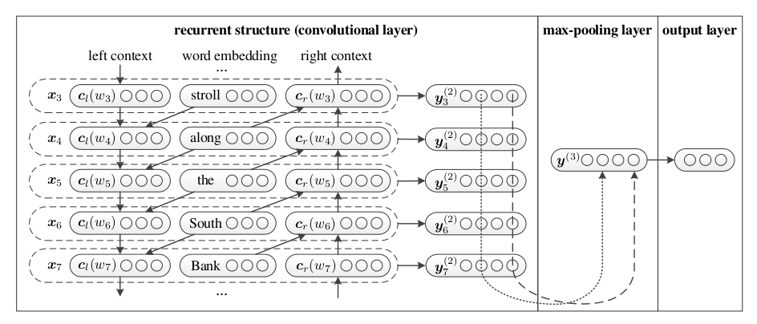

# RCNN Model
Here, we have implemented Recurrent Convolutional Neural Network model for text classification, as proposed in the paper [Recurrent Convolutional Neural Networks for Text Classification](https://www.aaai.org/ocs/index.php/AAAI/AAAI15/paper/download/9745/9552).

Traditional RNNs have shown very promising results in text classification, due to the fact that they can capture contextual information while representing the sentence by fixed size vector. However, this representation is often biased, as words appearing later in the sentence/document are more dominent than the earlier words. Thus, some semantic information about the sentence might get lost, if earlier part of sentence contains some key components.

CNNs, on the other hand, don't have this problem, as the (max) pooling layer determines discriminative phrases in the text. Thus, CNNs may better capture semantic information of text compared to RNNs. Traditional CNN models for text classification use a simple convolutional filter, which may not be enough to capture the semantics of the text.

RCNN combines both the recurrent neural network and convolutional network to better capture the semantics of the text. RCNN, first uses recurrent structure to learn word representations for every word in the text. These word representations capture the contextual information to the greatest extent possible. This also reserves a large range of word ordering in the embeddings.
Then, max-pooling is applied to determine which features are important for the classification task. By combining the recurrent structure and max-pooling layer, RCNN utilizes the advantage of both recurrent neural models and convolutional neural models.

Bi-directional RNN is applied to find the left (*l_i*) and right (*r_i*) context for every word w_i. Then, these three are concatenated to represent a word. i.e.

*x_i* = [*l_i ; e_i ; r_i*]

These word representation are, then passed trough a linear layer and tanh activation to get new representations in dimension **h**. Finally max-pooling is performed on these **h**-dimensional vectors (elementwise) to get the final **h**-dimensional feature map.
This feature map is passed through a linear layer and softmax activation to make the classification.

## Model Architecture
The architecture of RCNN is as follows:

## Implementation Details
- Used pre-trained Glove Embeddings for initializing word vectors
- Used 64 hidden units for BiLSTM
- Dropout with keep probability 0.8
- Optimizer - Stochastic Gradient Descent
- Loss function - Negative Log Likelihood
