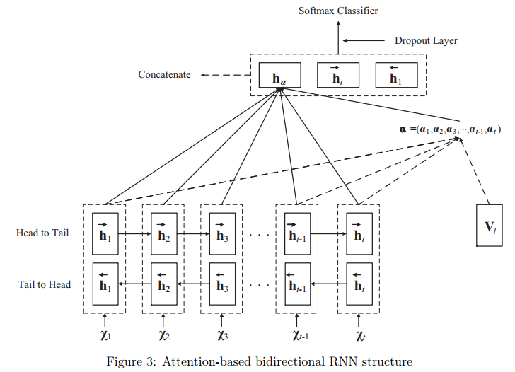

# Seq2Seq Model with Attention Mechanism
Implementation of Seq2Seq model with attention mechanism from [Neural Machine Translation by Jointly Learning to Align and Translate](https://arxiv.org/pdf/1409.0473.pdf), [Text Classification Research with Attention-based Recurrent Neural Networks](http://univagora.ro/jour/index.php/ijccc/article/download/3142/pdf)

Seq2Seq models have been widely used in problems such as machine translation, document summarization due to their capability to generate new sequence based on the already seen data. Here, we have implemented Seq2Seq model for text classification task.

Given a sentence/document, the encoder RNN learns the hidden representation for every word in the sentence. The final state *h_n* of this RNN also gives the representation of whole sentence. This final state *h_n* is then used to learn attention scores for each word in the sentence. After learning the attention weights, the weighted sum of encoder hidden states (hidden states of words) gives attention output vector *a_n*. Then, the concatenation [*h_n*,*a_n*] is passed to a linear layer to make the final classification.

## Model Architecture
The architecture of Seq2Seq Attention model for classification.

## Implementation Details
- Used pre-trained Glove Embeddings for initializing word vectors
- Used single layer BiLSTM as Encoder
- Used 32 hidden units within each BiLSTM layer
- Optimizer - Stochastic Gradient Descent
- Loss function - Negative Log Likelihood
- Flexible sequence length for BiLSTM. i.e. sequence length is determined by batch
